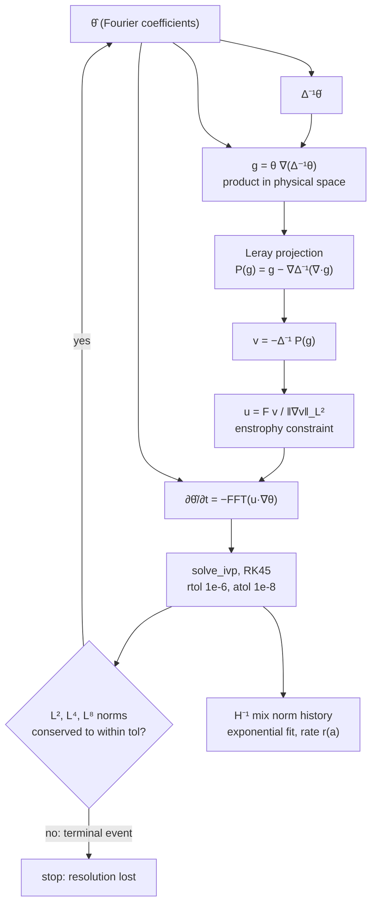
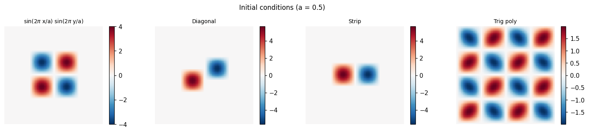
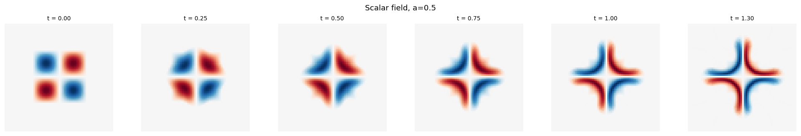
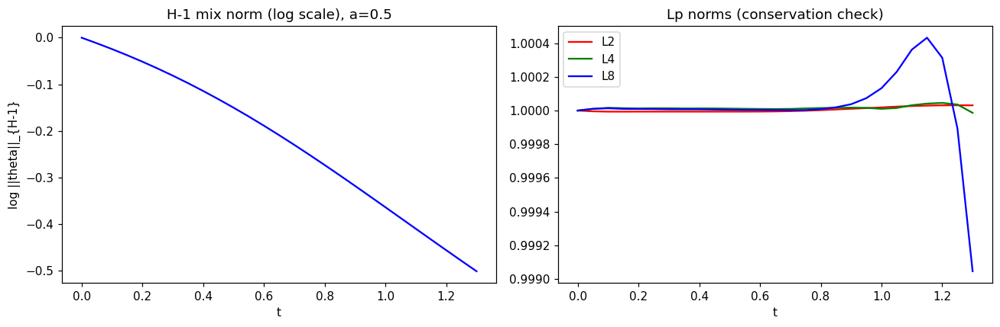
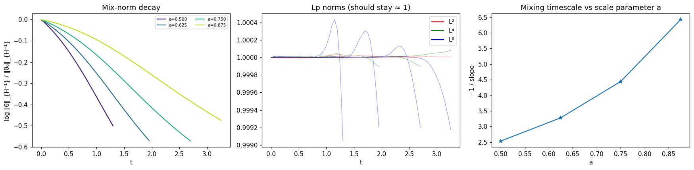

# Optimal Mixing of Passive Scalars

Master's thesis project by Adebanji Adelowo: a Python pseudo-spectral simulation of the
**Lin-Thiffeault-Doering optimal mixing velocity** for passive scalars on the 2-torus $[0,1]^2$,
ported from [Gautam Iyer's MATLAB code](https://www.math.cmu.edu/~gautam/research/201208-mix-bounds/).

**Full write-up (authoritative):** [`optimal_mixing_thesis_report.pdf`](optimal_mixing_thesis_report.pdf)  
**Abstract:** [`abstract.md`](abstract.md) / [`abstract.pdf`](abstract.pdf)

---

## Background

The passive scalar $\theta(x,y,t)$ evolves by

$$\partial_t\theta + (u\cdot\nabla)\theta = 0$$

The velocity $u$ is chosen at each instant to minimise the rate of change of
the **$H^{-1}$ mix norm**, the instantaneous-optimal (greedy) mixing strategy:

$$v = -\Delta^{-1} P(\theta\,\nabla\Delta^{-1}\theta), \qquad u = F\,\frac{v}{\|\nabla v\|_{L^2}}$$

where $P$ is the Leray projection and $F$ is the enstrophy constraint. The scalar transport
equation is solved on $[0,1]^2$ using FFTs for spatial discretisation and an adaptive
Dormand-Prince RK45 scheme for time integration.

One evaluation of the right-hand side (`make_convection_hat` in `python_code/mixing.py`), and the
loop that integrates it. Derivatives and $\Delta^{-1}$ are applied in Fourier space; products are
formed in physical space:



**References**  
- Lin, Thiffeault & Doering (2011): *Optimal stirring strategies*, J. Fluid Mech.  
- Iyer, Kiselev & Xu (2014): *Lower bounds on the mix norm*, Nonlinearity  

PDFs are in [`references/`](references/).

---

## Results

### Thesis results

Four families of initial conditions, parameterised by a support-size scale $a$, are studied
under $L^p$ norm conservation as a resolution diagnostic and stopping criterion.

For a representative case ($a = 0.5$, $N = 64$), the $H^{-1}$ mix norm decays approximately
exponentially under LTD stirring, with fitted decay rate $r \approx 0.44$ (mixing timescale
$\tau = 1/r \approx 2.27$). Across eight values of $a \in [0.5,\, 0.9375]$, a power-law fit
gives $r \propto a^{-1.78}$ at $N = 64$ and $r \propto a^{-1.61}$ at $N = 32$, compared with the
$a^{-1}$ scaling characteristic of the Iyer-Kiselev-Xu enstrophy-constrained lower bound. Each
rate is fitted over the last two thirds of a run, and each run ends when the $L^p$ resolution
check fires.

### Resolution study

A follow-up study extends the same experiment to $N = 32, 64, 128, 256, 512$, adds a
2/3-rule dealiased variant, a tighter time-integration tolerance and a second initial-data
family, and compares resolutions through spectrally exact field differences, $H^{-1}$
differences, shell spectra and fits on fixed time windows. The full analysis, tables and
figures are in [`RESOLUTION_STUDY.md`](RESOLUTION_STUDY.md).

| N | 32 | 64 | 128 | 256 | 512 |
|---|---:|---:|---:|---:|---:|
| $\alpha_N$, thesis fit protocol | 1.612 | 1.777 | 1.663 | 1.481 | 1.401 |
| $\alpha$ on the $N{=}32$ fit windows | 1.6117 | 1.6082 | 1.6073 | 1.6071 | 1.6070 |
| $\alpha$ on the $N{=}64$ fit windows | | 1.7766 | 1.7751 | 1.7747 | 1.7746 |

($r \propto a^{-\alpha}$, sine-bump data, $F = 1$.)

* **The thesis values are reproduced exactly**, including every entry of the thesis
  rate tables.
* **Central result: the resolution dependence of the thesis-protocol exponent is primarily a
  moving-fit-window effect.** The thesis fits the last two thirds of each run, and each run
  ends when the $L^p$ check fires. A finer grid stays resolved longer, so its fit window lies
  at later physical times. On a fixed set of time windows the exponent converges with
  resolution (observed order about 2; the values on the $N{=}32$ windows change by less than
  $5\times10^{-3}$ from $N = 32$ to $N = 512$). The drift of the thesis-protocol exponent is
  therefore not explained by spatial discretisation error over the common resolved time
  intervals, and the sequence $\alpha_N$ (1.61, 1.78, 1.66, 1.48, 1.40) is not a conventional
  grid-convergence sequence; Richardson extrapolation is not justified for it.
* **The effective exponent changes with time.** The local decay rate
  $-d\log\|\theta\|_{H^{-1}}/dt$ rises and then falls for every $a$, and the local exponent
  fitted at a fixed time drifts from about 2.9 near $t = 0$ to between 0.87 and 1.19 for
  $2.5 \le t \le 4$, then keeps changing. It agrees between $N = 256$ and $512$ to
  $2\times10^{-4}$. Passing near 1 over this interval does not establish $a^{-1}$ scaling.
* **Aliasing and time-integration error have negligible effect on rates fitted over a common
  window** (relative agreement of $6\times10^{-6}$ with a 2/3-rule dealiased scheme at
  $N = 128$ and 256, and below $10^{-6}$ with tighter RK45 tolerances at $N = 64$ to 256).
  Dealiasing does change when the $L^p$ check fires; through the stopping time it changes the
  thesis fit window, and hence the thesis-protocol exponent (by up to 0.4).
* **The exponent depends on the initial data**: the diagonal-pair data used by Iyer, Kiselev
  and Xu give thesis-protocol exponents between 0.65 and 0.85 for $N \ge 64$. With only two
  families tested, the fitted exponent should not be presented as a universal constant of
  LTD stirring.

On common resolved time intervals, the inferred scale dependence converges with resolution.
The effective exponent varies substantially with time and with the tested initial data, so
the computations do not support a single universal or asymptotic power-law exponent. The
$a^{-1}$ result used for comparison is the scaling of a lower bound on the mix norm (an upper
limit on how fast any enstrophy-constrained flow can mix, up to constants), not a prediction
that the instantaneous LTD strategy must attain. The simulations do not resolve late enough
times to determine the asymptotic behaviour.


### Thesis figures

The figures below are outputs of the demo notebook
[`Optimal_Mixing_Simulation.ipynb`](Optimal_Mixing_Simulation.ipynb) ($N = 64$, $F = 1$). The
thesis numbers come from the full report's runs; the reduced four-value sweep here is
illustrative.

**Initial conditions.** The four families of initial data at $a = 0.5$, each $L^2$-normalised
and supported in $[0,a]^2$.



**Scalar field evolution.** Snapshots of $\theta$ under LTD stirring for the sinusoidal
initial data at $a = 0.5$. The flow stretches the four cells into progressively thinner
filaments until the $L^p$ resolution check stops the run.



**Norm evolution.** Left: $\log \|\theta\|_{H^{-1}}$ for $a = 0.5$. Right: $L^2$, $L^4$ and
$L^8$ norms, which should remain constant; the drift in $L^8$ near the end signals loss of
resolution and triggers the stopping criterion.



**Multi-scale sweep.** Normalised mix-norm decay, $L^p$ conservation, and the fitted mixing
timescale ($-1/\text{slope}$) for $a \in \{0.5, 0.625, 0.75, 0.875\}$.



---

## Repository Layout

```
Master-Thesis/
├── python_code/
│   ├── mixing.py                        # full simulation module
│   ├── convergence.py                   # grid transfer, spectra, fits (resolution study)
│   ├── convergence_study.py             # command-line resolution study
│   ├── convergence_figures.py           # figures from the study summaries
│   ├── tests/                           # pytest verification and regression tests
│   ├── requirements.txt                 # dependencies
│   ├── 01_operators_and_idata.ipynb     # notebook: spectral ops + initial data
│   └── 02_rhs_simulation_analysis.ipynb # notebook: RHS, simulation, analysis
├── matlab_code/                         # original MATLAB implementation
├── references/                          # key papers (PDF)
├── results/summary/                     # resolution-study summaries (JSON, Markdown tables)
├── images/                              # README figures (demo notebook)
├── images/convergence/                  # resolution-study figures
├── figures/                             # generated figures (PDF, created locally, not committed)
├── RESOLUTION_STUDY.md                  # resolution study: methods, results, limitations
├── Optimal_Mixing_Simulation.ipynb      # high-level demo notebook
├── optimal_mixing_report.tex            # SUPERSEDED draft source, kept for record only
├── optimal_mixing_report.pdf            # SUPERSEDED draft, 21 pages (see notice on p.1)
├── optimal_mixing_thesis_report.tex     # current report source (corrected)
└── optimal_mixing_thesis_report.pdf     # current report, 16 pages: cite this one
```

---

## Setup

**Python 3.12** is required (tested with Anaconda 3.12.2).

```bash
# Clone and enter the project
git clone https://github.com/AdebanjiAdelowo/Master-Thesis.git
cd Master-Thesis

# Create a virtual environment
python3 -m venv .venv
source .venv/bin/activate
pip install -r python_code/requirements.txt
```

---

## How to Run

### Quick verification (~5 seconds)

```bash
cd python_code
python -c "from mixing import verify; verify()"
```

Expected output:
```
Verifying: N=32, F=1.0, a=0.5, t_end=0.5
  Max L² drift:       1.13e-04  (should be < 5e-4)
  H⁻¹ norm at t_end:  0.8598   (should be < 1.0)
  Verification: PASS
```

### Tests

```bash
cd python_code
python -m pytest tests
```

The tests check the spectral operators against analytic functions (including spectral
convergence of derivatives), the inverse Laplacian and zero mode, the Leray projection,
the $H^{-1}$ and $L^p$ norm formulas, the initial data, the enstrophy normalisation and
steepest-descent property of the LTD velocity, transport by prescribed velocities against
exact solutions, dealiasing, the diffusion term, grid transfer, the fitting helpers, and
exact reproduction of the thesis rate tables at $N = 32$ and $N = 64$.

### Reproducing the thesis tables

```bash
cd python_code
python -m pytest tests/test_regression.py -q
```

These tests rerun the thesis sweeps at $N = 32$ and $N = 64$ (a few seconds) and check every
entry of the thesis rate tables and the fitted exponents 1.61 and 1.777 exactly. The
interactive sweep is described under [Full sweep](#full-sweep).

### Resolution study

All commands run from `python_code/`.

**Regenerate the figures from the committed summaries** (no simulation needed):

```bash
python convergence_study.py figures --tag sin-orig --compare sin-orig_vs_sin-dealias --families diag-orig
```

This rewrites `images/convergence/` from `results/summary/`.

**Small trial study** (under a minute), written to `results-demo/` so that the committed
summaries and figures are not touched:

```bash
python convergence_study.py --root ../results-demo run --N 32 64 128 --workers 4
python convergence_study.py --root ../results-demo analyze --tag sin-orig
python convergence_study.py --root ../results-demo figures --tag sin-orig --out ../results-demo/figures
```

`run` integrates every $(N, a)$ case and stores raw data under `<root>/raw/`; `analyze` writes
`<root>/summary/<tag>/tables.md` and JSON summaries; `figures` builds figures from those
summaries only. The default root is `results/`.

**Full study** ($N$ up to 512, about 25 minutes of wall time with 8 workers on an 11-core
machine, about 3 GB of raw output): see
[`RESOLUTION_STUDY.md`](RESOLUTION_STUDY.md#7-reproducing-the-study).

### Jupyter Notebooks

```bash
cd python_code
jupyter notebook
```

| Notebook | Content |
|---|---|
| `01_operators_and_idata.ipynb` | Spectral operators, wavenumbers, initial data |
| `02_rhs_simulation_analysis.ipynb` | ODE RHS step-by-step, simulation, norm analysis |
| `../Optimal_Mixing_Simulation.ipynb` | High-level demo with all plots |

Select a kernel that uses the virtual environment created above.

### Full sweep

```bash
cd python_code
python mixing.py
```

Runs `main()` with defaults: `N=64`, `F=1`, `a ∈ [0.5, 15/16]` in steps of `1/16`.  
Results are displayed as interactive plots; pass `save_path='run'` to save `.npz` + figures.

### Custom simulation

```python
from mixing import build_operators, idata_sin, run_simulation, plot_snapshots
import numpy as np, matplotlib.pyplot as plt

ops = build_operators(64)
res = run_simulation(0.5, idata_sin, ops, F=1.0, t_eval=np.arange(0, 5.05, 0.05))

print(f"H⁻¹ at t_end: {res['norm_hm1'][-1]:.4f}")
plot_snapshots(res['theta'], res['t'], ops)
plt.show()
```

---

## Key Parameters

| Parameter | Default | Description |
|---|---|---|
| `N` | 64 | Spectral modes per direction (power of 2) |
| `F` | 1.0 | Enstrophy constraint $\|\nabla u\|_{L^2} = F$ |
| `a` | 0.5 | Scale parameter (initial data support size) |
| `tol` | 1e-3 | $L^p$ conservation tolerance (stopping criterion) |
| `rtol`, `atol` | 1e-6, 1e-8 | RK45 tolerances |
| `dealias` | False | 2/3-rule dealiasing of both quadratic products |
| `kappa` | 0 | diffusivity in $\partial_t\theta + u\cdot\nabla\theta = \kappa\Delta\theta$ (optional extension) |

---

## Module Reference (`mixing.py`)

| Function | Description |
|---|---|
| `build_operators(N)` | Build spectral operator dict (DEL_X, LAP_INV, …) |
| `idata_sin(a, ops)` | Sinusoidal initial data on $[0,a]^2$ |
| `idata_diag(a, ops)` | Diagonal antisymmetric initial data |
| `idata_strip(a, ops)` | Strip initial data on $[0,a]\times[0,a/2]$ |
| `idata_trigpoly(a, ops)` | Trigonometric polynomial initial data |
| `make_convection_hat(ops, F, dealias, kappa)` | Build the ODE right-hand side closure |
| `ltd_velocity_hat`, `leray_project`, `advection_hat` | Components of the right-hand side |
| `integrate(a, idata_fn, ops, …)` | Integrate one run and return the `solve_ivp` solution |
| `make_res_check(N, dx, …)` | Build the $L^p$ resolution-check event |
| `run_simulation(a, idata_fn, ops, …)` | Run a single simulation |
| `compute_norms(…)` | Compute $L^2$, $L^4$, $L^8$, $H^{-1}$ norms |
| `plot_mix_norm(results, a_range)` | Plot log mix norm vs time |
| `plot_lp_norms(results)` | Plot $L^p$ conservation check |
| `plot_mixing_rate(results, a_range)` | Plot mixing timescale vs $a$ |
| `plot_snapshots(theta, t, ops)` | Plot spatial snapshots |
| `replot_norms(results, a_range)` | Refined slope fit + power-law analysis |
| `save_results(results, a_range, path)` | Save to compressed `.npz` |
| `load_results(path)` | Load saved results |
| `verify(N, F, a, t_end)` | Quick sanity check |
| `main(…)` | Full sweep driver |

---

## MATLAB Correspondence

| MATLAB file | Python equivalent |
|---|---|
| `gen_figures.m` | `main()` + `run_simulation()` |
| `convection_hat.m` | `make_convection_hat()` |
| `res_check.m` | `make_res_check()` |
| `fn_norm.m` | `compute_norms()` |
| `idata_sin/diag/strip/trigpoly.m` | same names in `mixing.py` |
| `replot_figs.m` | `replot_norms()` |
| `save_data.m` | `save_results()` / `load_results()` |

---

## Additional Resources

* [`dft_beginners_guide.md`](dft_beginners_guide.md): a from-scratch introduction to the
  Discrete Fourier Transform and spectral methods, written for readers of this thesis.
* [`python_code/00_dft_for_beginners.ipynb`](python_code/00_dft_for_beginners.ipynb): the
  companion interactive notebook.
* [`python_code/mixing_exp.md`](python_code/mixing_exp.md): function-by-function reference
  documentation for `python_code/mixing.py`.
* [`optimal_mixing_thesis_report_expanded.pdf`](optimal_mixing_thesis_report_expanded.pdf): a
  supplementary, code-oriented companion, not the submitted thesis, walking through the LTD
  velocity derivation and its NumPy implementation step by step with annotated code listings.
  `optimal_mixing_thesis_report.pdf` above is the authoritative document to cite.

---

## Limitations

* The finest resolution is $N = 512$, which has not been compared with $N = 1024$;
  quantities at $N = 512$ are checked only against the dealiased scheme at the same
  resolution.
* The accessible resolved time is finite ($t \le 6.45$ at $N = 512$ for the thesis scheme,
  $t \le 7.8$ with dealiasing), and the tested range of $a$ spans less than a factor of two.
* Only two initial-data families were examined. No asymptotic exponent has been
  established; late-time behaviour, including whether the decay rate eventually stops
  depending on $a$, is not resolved.
* The sine-bump initial data have a derivative jump at the edge of their support, which
  limits convergence to algebraic order.
* The thesis fit window is tied to the stopping time. Because the decay rate varies in time,
  any single fitted exponent depends on this choice.
* Optional diffusion is implemented and tested, but no Peclet-number study was performed;
  the diffusion term is integrated explicitly and becomes stiff for large $\kappa N^2$.

See [`ERRATA.md`](ERRATA.md) for corrections made to the report after the original draft
(citation attribution, a sign-convention fix, and related terminology changes) and for
notes on the thesis documents in light of the resolution study.

## License

Code: MIT.  
Original MATLAB implementation © Gautam Iyer, used with permission for research purposes.
