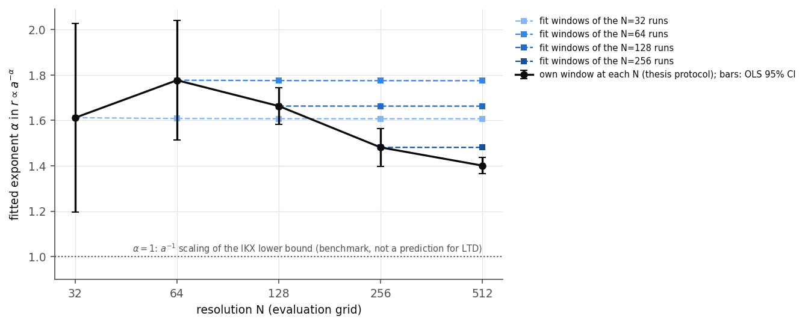
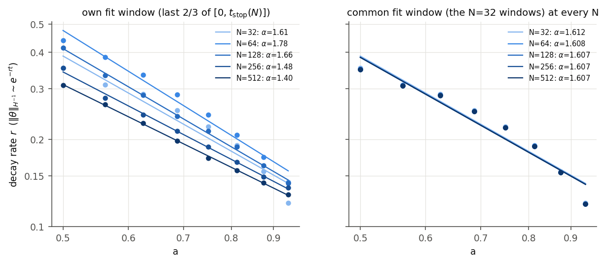
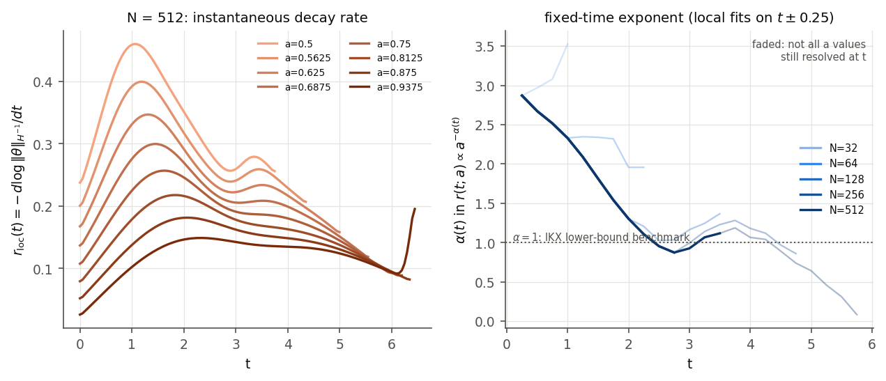
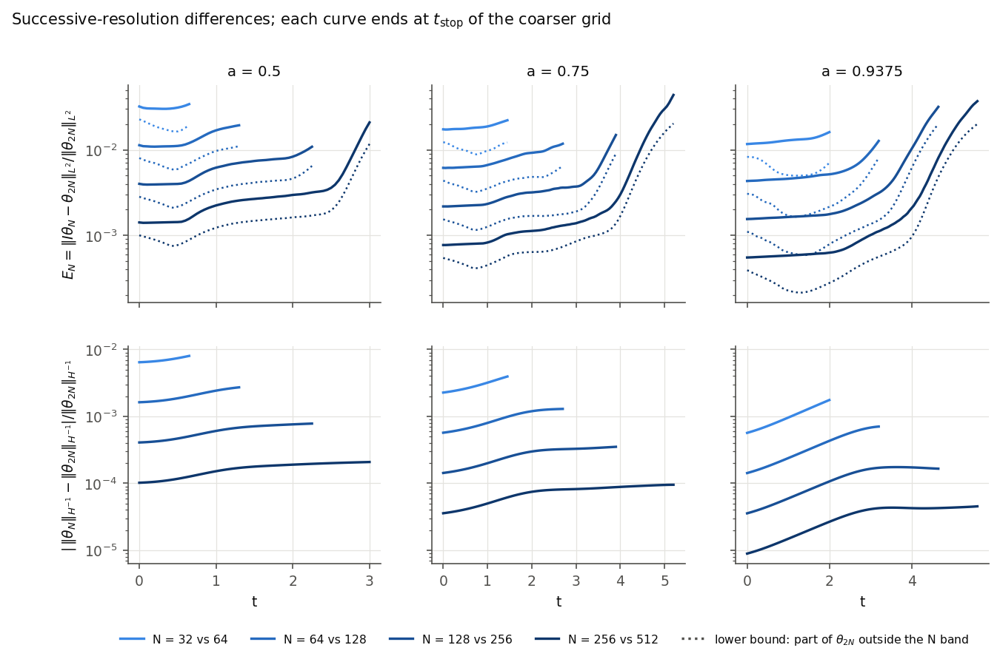
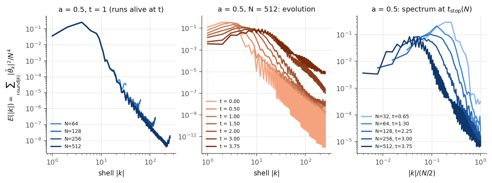
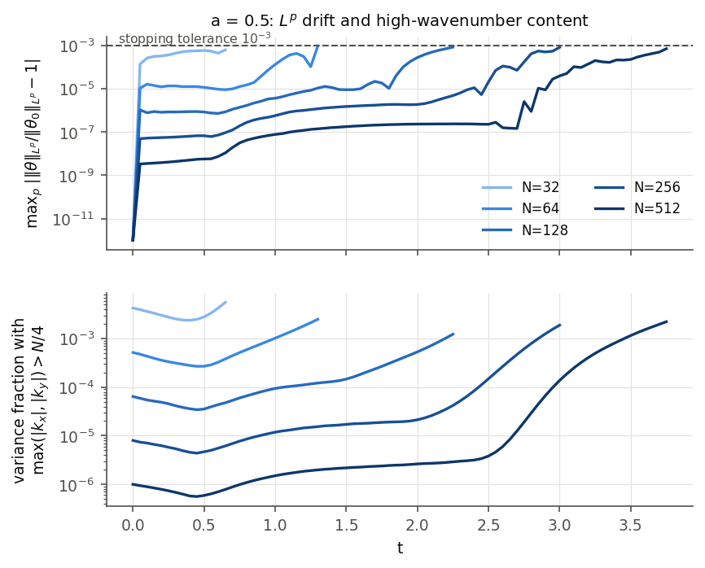
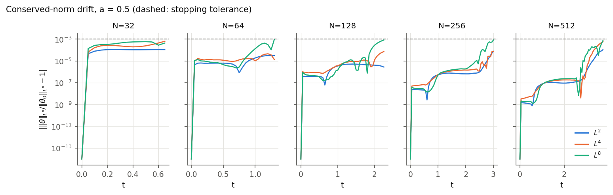
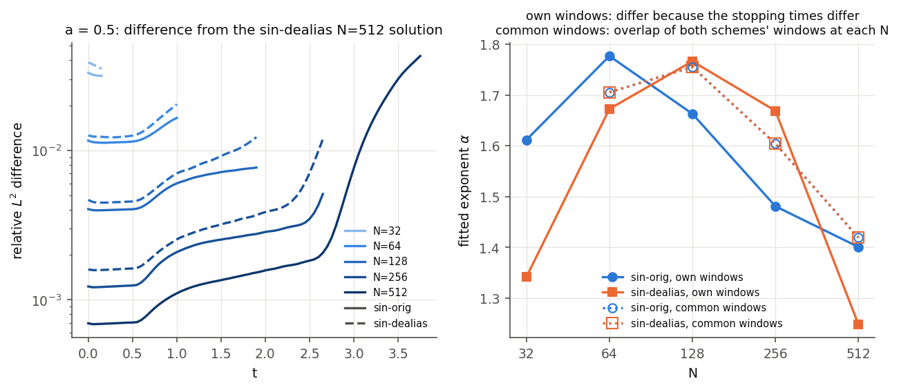
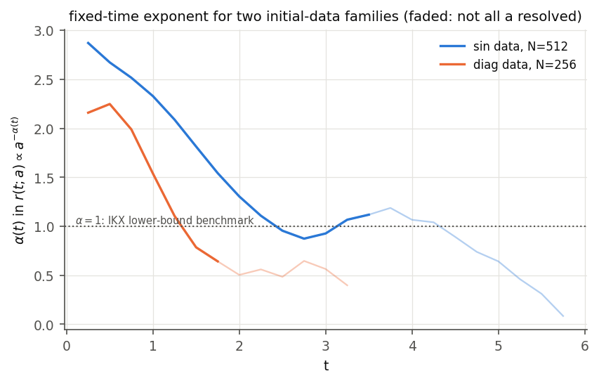

# Resolution Study of the Fitted Mixing-Rate Exponent

This document reports a resolution study of the Lin-Thiffeault-Doering (LTD)
optimal-mixing simulations described in the [README](README.md) and in
[`optimal_mixing_thesis_report.pdf`](optimal_mixing_thesis_report.pdf).

The thesis fits an exponential decay rate $r(a)$ to the $H^{-1}$ mix norm for eight
support sizes $a \in \lbrace0.5, 0.5625, \dots, 0.9375\rbrace$ and then a power law
$r \propto a^{-\alpha}$. It reports $\alpha \approx 1.61$ at $N = 32$ and
$\alpha \approx 1.78$ at $N = 64$, compared with the $a^{-1}$ scaling of the
Iyer-Kiselev-Xu (IKX) enstrophy-constrained lower bound. The question studied here is
what causes the change between resolutions, and whether the numerical evidence
supports any limiting value of $\alpha$.

## Summary

**Central result.** The apparent resolution dependence of the thesis-protocol exponent
is primarily a moving-fit-window effect. It is not evidence that the numerical
solutions are spatially unconverged over common resolved times: on fixed physical time
windows the fitted exponent converges with resolution, at an observed order of about 2.
The thesis protocol fits the last two thirds of each run, each run ends when the $L^p$
resolution check fires, and a finer grid stays resolved longer. The fit window
therefore moves to later physical times as $N$ increases. Because the effective
exponent itself changes with time, fitting one power law over different time intervals
gives different values of $\alpha$.

Three questions are kept separate throughout:

* **A. Solution convergence.** On common resolved time intervals, successive
  resolutions agree, and the rates and exponents fitted on a fixed window converge
  (Sections 3.3 and 3.5).
* **B. Fit-window dependence.** The thesis window depends on $t_{\rm stop}$, which
  depends on $N$ (and on the scheme). The thesis-protocol sequence $\alpha_N$ is
  therefore not a conventional grid-convergence sequence (Sections 3.2, 3.4 and 3.6).
* **C. Asymptotic behaviour.** The simulations do not resolve late enough times to
  determine an asymptotic exponent (Sections 3.4 and 5).

Three kinds of exponent appear below:

* the **finite-time fitted exponent** $\alpha_N$ or $\alpha(W)$: a power law fitted to
  rates averaged over a stated time window $W$ (one window per value of $a$);
* the **local (effective) exponent** $\alpha(t)$: a power law fitted to rates measured
  over a short interval around a fixed time $t$;
* the **asymptotic exponent**: the long-time limit of the scale dependence, if one
  exists. None is established here.

All numbers below are read from the machine-generated summaries in
[`results/summary/`](results/summary/) (see `tables.md` in each directory). Every
figure is regenerated from those summaries by
[`python_code/convergence_figures.py`](python_code/convergence_figures.py).

---

## 1. Setup

Unless stated otherwise every run uses the thesis configuration: sine-bump initial
data, $F = 1$, output times $t = 0, 0.05, \dots, 10$, RK45 with `rtol = 1e-6`,
`atol = 1e-8`, the $L^2/L^4/L^8$ resolution check with tolerance $10^{-3}$, and the
thesis fit (least squares on $\log\Vert\theta\Vert_{H^{-1}}$ over the last two thirds of
the samples in $[0, t_{\rm stop}]$). Only $N$ changes along the ladder.

| Data set (tag) | Scheme | Resolutions |
|---|---|---|
| `sin-orig` | thesis scheme (no dealiasing) | 32, 64, 128, 256, 512 |
| `sin-dealias` | 2/3-rule dealiasing of both quadratic products | 32, 64, 128, 256, 512 |
| `sin-orig-rtol1e-08` | thesis scheme, RK45 `rtol = 1e-8`, `atol = 1e-10` | 64, 128, 256 |
| `diag-orig` | thesis scheme, diagonal-pair initial data | 32, 64, 128, 256 |

For $a$ on the $1/16$ lattice and $N \ge 32$, the centring shifts are whole grid
cells, so every resolution samples the same continuous initial function.

**Runtime** (sum over the eight $a$ values, sine data, thesis scheme; runs executed
7 to 8 at a time on an 11-core Apple M3 Pro, which inflates per-run times relative
to a single run, e.g. about 35 s standalone versus 57 to 92 s in the batch at
$N = 256$):

| N | 32 | 64 | 128 | 256 | 512 |
|---|---:|---:|---:|---:|---:|
| total CPU time | 0.7 s | 7 s | 59 s | 11 min | 2.2 h |
| longest single run | 0.1 s | 1 s | 9 s | 92 s | 18.5 min |

The number of right-hand-side evaluations roughly doubles with each doubling of
$N$, so the cost grows roughly like $N^3 \log N$.

## 2. Diagnostics

**Cross-resolution field error.** Solutions on different grids are never compared
point by point. The coarse solution is represented by its trigonometric
interpolant (zero-padded Fourier coefficients, with the Nyquist coefficient split
between $\pm N/2$), and

```math
E_N(t) = \frac{\Vert I\theta_N - \theta_{2N}\Vert_{L^2}}{\Vert\theta_{2N}\Vert_{L^2}}
```

is evaluated exactly in Fourier space by Parseval's identity. The fraction of
$\theta_{2N}$ carried by modes with $\max(|k_x|,|k_y|) \gt N/2$ cannot be represented
on the $N$ grid at all, so it is a rigorous lower bound on $E_N$.

**Observable error.** $`E^{H^{-1}}_N(t) = \big|\,\Vert\theta_N\Vert_{H^{-1}} - \Vert\theta_{2N}\Vert_{H^{-1}}\big| / \Vert\theta_{2N}\Vert_{H^{-1}}`$ using unnormalised norms.

**Fixed windows.** The thesis fit window of a run at resolution $N_w$ is reused on
the finer runs $N \gt N_w$. This separates the discretisation error in $r$ and
$\alpha$ from the effect of the fit window moving when $t_{\rm stop}$ changes.

**Local (fixed-time) exponent.** A local rate $r(t;a)$ is fitted on
$[t - 0.25, t + 0.25]$ for every $a$ whose run is still resolved there, and
$\alpha(t)$ is fitted from $r(t;a) \propto a^{-\alpha(t)}$.

**Spectra.** Shell sums $E(|k|) = \sum_{\mathrm{round}|k| = m} |\hat\theta_k|^2/N^4$
(so that $\sum_m E = \Vert\theta\Vert^2_{L^2}$) and the variance fraction in modes with
$\max(|k_x|,|k_y|) \gt N/4$.

**Fit statistics.** Each fit records slope, intercept, number of samples, window,
RMS residual, OLS standard error and the lag-1 autocorrelation of the residuals.

## 3. Results

### 3.1 Thesis values

The code reproduces the thesis exactly: every entry of Tables 2 and 3 (stopping
times, final mix norms, rates, timescales), $\alpha = 1.6117$ at $N = 32$ and
$\alpha = 1.7766$ at $N = 64$. These values are checked by automated tests.

### 3.2 Exponent with the thesis protocol

| N | $\alpha_N$ | OLS s.e. | OLS 95% interval | $t_{\rm stop}$ range | trigger |
|---:|---:|---:|---|---|---|
| 32 | 1.612 | 0.170 | [1.20, 2.03] | 0.65 to 2.00 | $L^8$ |
| 64 | 1.777 | 0.107 | [1.51, 2.04] | 1.30 to 3.25 | $L^8$ |
| 128 | 1.663 | 0.033 | [1.58, 1.74] | 2.25 to 4.65 | $L^8$, $L^4$ |
| 256 | 1.481 | 0.034 | [1.40, 1.57] | 3.00 to 5.85 | $L^8$, $L^4$ |
| 512 | 1.401 | 0.014 | [1.37, 1.44] | 3.75 to 6.45 | $L^8$, $L^2$ |

The sequence rises and then falls; successive differences are $+0.165$, $-0.114$,
$-0.182$, $-0.080$. Each entry is fitted over a different set of physical time
windows, so the sequence mixes discretisation error with the change of window and
is not a conventional grid-convergence sequence. It shows no monotone convergence
regime, and Richardson extrapolation is not justified for it.

The OLS intervals are regression statistics for eight points only. They do not
include discretisation error or the dependence on the fit window, and the
per-run fits behind them have strongly correlated residuals (lag-1
autocorrelation 0.86 to 0.96 for $N \ge 128$), which indicates systematic
curvature of $\log\Vert\theta\Vert_{H^{-1}}$ rather than random scatter.



### 3.3 Exponent on fixed windows

| Windows taken from | N = 32 | 64 | 128 | 256 | 512 | observed order | Richardson |
|---|---:|---:|---:|---:|---:|---|---|
| N = 32 runs | 1.6117 | 1.6082 | 1.6073 | 1.6071 | 1.6070 | 1.98, 1.98, 1.99 | 1.6070 |
| N = 64 runs | | 1.7766 | 1.7751 | 1.7747 | 1.7746 | 1.94, 2.00 | 1.7746 |
| N = 128 runs | | | 1.6630 | 1.6627 | 1.6626 | 1.99 | (2 values) |
| N = 256 runs | | | | 1.4810 | 1.4810 | | |

On any fixed set of time windows, $\alpha$ converges with an observed order of about
2, and the extrapolated values differ from the $N = 512$ values by less than
$10^{-4}$. The rates themselves agree to $7\times10^{-5}$ (relative) between
$N = 256$ and $N = 512$ on the $N = 256$ windows.

Consequently the drift of the thesis-protocol exponent is not explained by spatial
discretisation error over the common resolved time intervals. At $N = 32$, for
example, the exponent on the $N = 32$ windows differs from its extrapolated value by
about $0.005$, while the thesis-protocol exponent changes by $0.165$ between
$N = 32$ and $N = 64$. What changes is the fit window: a finer grid stays resolved
longer, so its window covers later times.



### 3.4 The decay rate depends on time



The instantaneous rate $`r_{\rm loc}(t) = -\,d\log\Vert\theta\Vert_{H^{-1}}/dt`$ is not
constant over any resolved interval. For every $a$ it rises to a maximum and then
decreases; the maximum occurs near $t \approx 1$ for $a = 0.5$ and near
$t \approx 2.3$ for $a = 0.9375$. The fixed-time exponent (sine data, $N = 512$;
$n_a$ is the number of $a$ values still resolved):

| t | 0.25 | 0.5 | 1.0 | 1.5 | 2.0 | 2.5 | 2.75 | 3.0 | 3.5 | 4.0 | 4.5 | 5.0 | 5.5 |
|---|---|---|---|---|---|---|---|---|---|---|---|---|---|
| $\alpha(t)$ | 2.87 | 2.67 | 2.33 | 1.81 | 1.30 | 0.96 | 0.87 | 0.93 | 1.12 | 1.07 | 0.89 | 0.64 | 0.31 |
| $n_a$ | 8 | 8 | 8 | 8 | 8 | 8 | 8 | 8 | 8 | 7 | 6 | 5 | 4 |

For the same set of $a$ values, $\alpha(t)$ at $N$ and $2N$ agrees to within
$5\times10^{-3}$ at every tested time (within $2\times10^{-4}$ for $N = 256$
versus $512$, up to $t = 4.75$). The time dependence of the local exponent is
therefore not explained by spatial discretisation error over the resolved
intervals.

The thesis-protocol exponent is a power law fitted to rates averaged over
$a$-dependent windows, so it reflects the local behaviour over those windows. As
$N$ grows, the windows extend into the interval where $\alpha(t)$ is smaller, which
is consistent with the decrease from $1.78$ ($N = 64$) to $1.40$ ($N = 512$).

The local exponent passes near 1 during $2.5 \lesssim t \lesssim 4$ and then keeps
changing. This is a statement about the observed interval only; it is not evidence
that the scale dependence converges to $a^{-1}$.

Where $n_a \lt 8$, the exponent rests on the largest $a$ values only and is not
comparable with the full-set values. Near $t \approx 6$ the rates of the four
largest $a$ are almost equal (0.095 to 0.099, dealiased $N = 512$ runs), and
after $t \approx 6.25$ they change abruptly. These late-time observations lie
within the last time unit before the runs stop and cannot be checked against a
finer grid.

### 3.5 Solution convergence and spectral content



| Pair | $E_N(0)$ | $E_N(t_{\rm stop}(N))$ | lower bound at $t_{\rm stop}(N)$ | max $E^{H^{-1}}_N$ in fit window |
|---|---|---|---|---|
| 32 / 64 | 1.2e-2 to 3.2e-2 | 1.6e-2 to 3.4e-2 | 7.0e-3 to 2.0e-2 | 8.0e-3 |
| 64 / 128 | 4.3e-3 to 1.1e-2 | 1.2e-2 to 1.9e-2 | 6.5e-3 to 1.1e-2 | 2.7e-3 |
| 128 / 256 | 1.5e-3 to 4.0e-3 | 1.1e-2 to 3.2e-2 | 6.5e-3 to 2.0e-2 | 7.8e-4 |
| 256 / 512 | 5.5e-4 to 1.4e-3 | 2.1e-2 to 5.1e-2 | 1.2e-2 to 2.4e-2 | 2.1e-4 |

(Ranges over the eight values of $a$.)

* The initial data are sine bumps multiplied by the indicator of a square. They are
  continuous with a derivative jump at the edge of the support, so their Fourier
  coefficients decay only algebraically. $E_N(0)$ falls by a factor of about 2.8
  per doubling of $N$, and the $L^p$ norms show a small immediate drift at the first
  output time that falls by roughly a factor of ten per doubling. The fixed-window
  exponents converge at order 2, not spectrally, for the same reason.
* At its own stopping time a run differs from the next finer run by 1 to 5% in
  $L^2$, and the rigorous lower bound shows that 1 to 2% of the finer solution lies
  outside the coarse band. The $L^p$ criterion therefore stops runs at a
  few-percent field error.
* The $H^{-1}$ norm weights low wavenumbers and is much less sensitive: its
  successive-resolution difference is at most $2\times10^{-4}$ for 256/512.
* At the stopping time, the variance fraction in modes with
  $\max(|k_x|,|k_y|) \gt N/4$ lies between $1\times10^{-3}$ and $5.6\times10^{-3}$ for
  every $N$ and $a$. Measured this way, the $L^p$ criterion fires at a roughly
  resolution-independent level of spectral crowding. The study does not replace
  the $L^p$ criterion with a spectral threshold.







### 3.6 Aliasing

The thesis scheme forms both quadratic products ($\theta\nabla\Delta^{-1}\theta$ and
$u\cdot\nabla\theta$) on the $N$ grid without dealiasing. The optional
dealiased scheme keeps $|k_x|, |k_y| \lt N/3$, restricts and renormalises the initial
data to that band, and truncates both products. With exact quadratic products the
truncated system conserves $\Vert\theta\Vert_{L^2}$ exactly (checked by a test), so in
that scheme the $L^2$ part of the resolution check measures only time-integration
error.

* On common time windows the two schemes give nearly identical rates: to within
  $6\times10^{-6}$ (relative) at $N = 128$ and $256$, and to within
  $5\times10^{-4}$ at $N = 512$, where the common window extends to the thesis
  scheme's stopping time. On identical windows, $\alpha$ at $N = 512$ is 1.4192
  (thesis scheme) and 1.4197 (dealiased).
* The schemes stop at different times. With its effective cutoff at $N/3$, the
  dealiased scheme stops earlier at small $N$ (for $a = 0.5$ at $N = 32$ it stops
  at $t = 0.15$) and later at $N = 512$ (up to $t = 7.80$ against $6.45$).
* With its own windows, the dealiased scheme gives
  $\alpha_N = 1.34, 1.67, 1.77, 1.67, 1.25$ for $N = 32, \dots, 512$.

The causal chain is therefore indirect. On common resolved time windows the two
schemes produce nearly identical rates at $N \ge 128$, so the resolved dynamics do not
differ materially. Dealiasing does change when the $L^p$ stopping check fires; that
changes the thesis fit window, and the changed window moves the thesis-protocol
exponent by up to $0.4$.



A related detail of the discretisation, inherited from the MATLAB code: the
first-derivative symbols zero the Nyquist mode while the inverse Laplacian keeps
it, so on the lines $k_x = N/2$ or $k_y = N/2$ the Leray projection is not exact and
the discrete velocity has a small divergence there. The affected content of $v$ is
about $10^{-6}$ of its energy at $N = 32$ and $10^{-11}$ at $N = 128$ for the
initial data, and it decreases strongly with $N$. The default scheme keeps this
behaviour so that the thesis results remain exactly reproducible. The dealiased
scheme removes the Nyquist modes altogether, and no measurable impact on the
reported quantities was found in the comparison above.

### 3.7 Time integration

Reducing the RK45 tolerances to `rtol = 1e-8`, `atol = 1e-10` (2.6 times more
right-hand-side evaluations) changes no stopping time for $N = 64$ to $256$, and the
fitted rates agree in all seven significant digits stored in the summaries (a relative
difference below $10^{-6}$). The largest field difference between the two tolerances,
$2\times10^{-3}$ in $L^2$ at $N = 256$, occurs at the stopping time, where fine-scale
fields are most sensitive; the $H^{-1}$ observable is not affected at the stored
precision. Time-integration error is negligible for every quantity reported here.

### 3.8 Initial-data family

IKX used diagonal-pair data (`idata_diag`) in their numerical section. With that
family the thesis protocol gives $\alpha_N = 0.25, 0.84, 0.85, 0.65$ for
$N = 32, 64, 128, 256$. The value at $N = 32$ comes from severely under-resolved
runs (for $a = 0.5$ the run stops at $t = 0.05$). The local exponent again agrees
between resolutions ($N = 128$ versus $256$ within $3\times10^{-3}$ on the same
$a$ values) and depends on time: about 2.2 at $t = 0.25$ to 0.5, 1.54 at $t = 1$,
0.79 at $t = 1.5$, and 0.4 to 0.65 later on fewer $a$ values.

The fitted exponents for this family differ substantially from those of the sine
bump over comparable windows. For the configurations tested, the fitted exponent
should therefore not be presented as a universal constant of LTD stirring. Only two
families were studied, so no broader statement about initial-data dependence is
made.



## 4. Conclusions

1. The thesis values $\alpha \approx 1.61$ ($N = 32$) and $1.78$ ($N = 64$) are
   reproduced exactly.
2. **Solution convergence (A).** On common resolved time intervals the solutions and
   the $H^{-1}$ observable converge with resolution, and on a fixed time window the
   fitted exponent computed at $N = 64$ is within $2\times10^{-3}$ of its
   extrapolated value (within $4\times10^{-4}$ at $N \ge 128$), with a consistent
   observed order near 2.
3. **Fit-window dependence (B).** The difference between the thesis values, and the
   continued drift at higher resolution (1.66, 1.48, 1.40 at $N = 128, 256, 512$),
   is not explained by spatial discretisation error over the common resolved
   intervals. It arises primarily because the thesis fit window, tied to
   $t_{\rm stop}$, moves to later physical times as $N$ increases. Richardson
   extrapolation is not justified for this sequence.
4. **Time dependence.** The $H^{-1}$ decay is not a single exponential over the
   resolved horizon. For the sine data the local exponent drifts from about 2.9 near
   $t = 0$ to values between 0.87 and 1.19 for $2.5 \le t \le 4$, and lower on
   fewer $a$ values later. Any single fitted exponent describes the chosen time
   window.
5. **Initial data.** The fitted exponent depends on the initial-data family (sine bump:
   1.4 to 1.8; diagonal pair: 0.65 to 0.85 at $N \ge 64$), among the two families
   tested.
6. **Asymptotic behaviour (C).** The simulations do not resolve late enough times to
   determine an asymptotic exponent.

## 5. Relation to the $a^{-1}$ benchmark

The IKX theorem (Theorem 1.1 of the reference) is a lower bound on
$\Vert\theta(t)\Vert_{H^{-1}}$ for any incompressible flow. Under an enstrophy constraint
$\Vert\nabla u\Vert_{L^2} \le F$, the exponential rate appearing in the bound is
proportional to $F/m(A_\lambda)^{1/2}$, where $A_\lambda$ is a super-level set of the
initial data; for support area of order $a^2$ this gives the $a^{-1}$ scaling used as
the benchmark. The bound limits how fast any enstrophy-constrained flow can mix, up to
unspecified constants and a prefactor that allows faster transient decay. It is not a
prediction of the rate attained by the instantaneous (greedy) LTD strategy, which need
not attain this scaling.

The present data show:

* finite-time fitted exponents between 1.4 and 1.8 for the sine data over the thesis
  windows at every resolution, and between 0.65 and 0.85 for the diagonal-pair data
  at $N \ge 64$;
* a local exponent for the sine data that passes near 1 during
  $2.5 \lesssim t \lesssim 4$ and keeps changing afterwards, which does not
  establish $a^{-1}$ scaling;
* no resolved late-time regime. Whether the rate eventually becomes independent of
  $a$ (a possibility raised by IKX) is not resolved; the relevant times lie at the
  end of the $N = 512$ runs and cannot be verified with a finer grid.

A comparison between a single fitted exponent and $a^{-1}$ is therefore a comparison
at a particular time window and initial-data family. The available simulations do not
determine the asymptotic scale dependence of the LTD strategy, and they do not show
that it attains $a^{-1}$ scaling.

## 6. Limitations

These define the scope of what has and has not been demonstrated.

* The finest resolution is $N = 512$; it has not been compared with $N = 1024$.
  Quantities on the $N = 512$ fit windows, and the local exponent after
  $t \approx 4.75$, have no finer-grid check. The dealiased and thesis schemes agree
  there to about $10^{-3}$ in $\alpha$, which is a scheme-independence check, not a
  resolution check.
* The accessible resolved time is finite: at most $t \approx 7.8$, and shorter for
  small $a$.
* The tested interval of $a$ ($0.5$ to $0.9375$) spans less than a factor of two.
* Only two initial-data families were examined, with the same eight values of $a$.
* No asymptotic exponent has been established.
* The kinked initial data limit convergence to algebraic order.
* The study keeps the thesis stopping rule. Fit windows defined by a physical
  criterion rather than by $t_{\rm stop}$ would be a natural refinement.
* Optional diffusion ($\kappa \gt 0$) is implemented and tested, but no Peclet-number
  study was performed.

## 7. Reproducing the study

From `python_code/` (Python 3.12, NumPy, SciPy, Matplotlib):

```bash
# thesis scheme, N = 32 to 512 (about 20 to 25 min wall time with 8 workers on 11 cores)
python convergence_study.py run --N 32 64 128 256 512 --workers 8
# controls
python convergence_study.py run --N 32 64 128 256 512 --dealias --workers 7
python convergence_study.py run --N 64 128 256 --rtol 1e-8 --atol 1e-10 --workers 8
python convergence_study.py run --N 32 64 128 256 --ic diag --workers 8

# summaries (results/summary/<tag>/) and comparisons
python convergence_study.py analyze --tag sin-orig
python convergence_study.py analyze --tag sin-dealias
python convergence_study.py analyze --tag diag-orig
python convergence_study.py compare --tags sin-orig sin-dealias --reference sin-dealias:512
python convergence_study.py compare --tags sin-orig sin-orig-rtol1e-08 --reference sin-orig:512

# figures (images/convergence/)
python convergence_study.py figures --tag sin-orig --compare sin-orig_vs_sin-dealias --families diag-orig
```

The figure step needs only the committed summaries. With a different Matplotlib version
the regenerated images can differ slightly in layout (font metrics); the plotted data do
not change.

Raw output (about 3 GB for the four data sets above) is written to `results/raw/`,
which is not tracked. `python convergence_study.py run --help` lists all options,
including `--a`, `--t-end`, `--tol`, `--no-stop`, `--no-fields` and `--kappa`.
